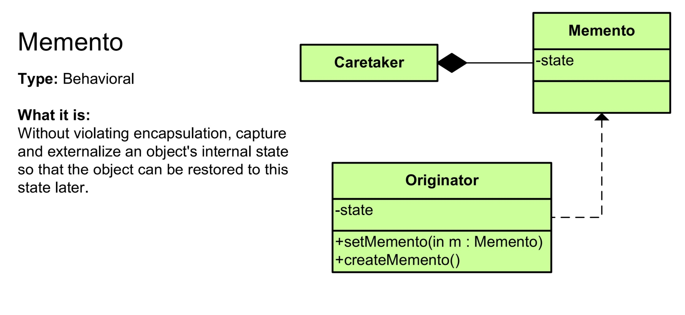
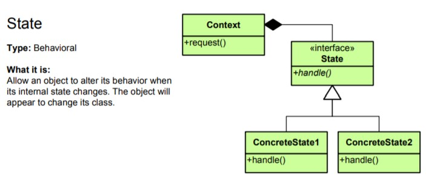
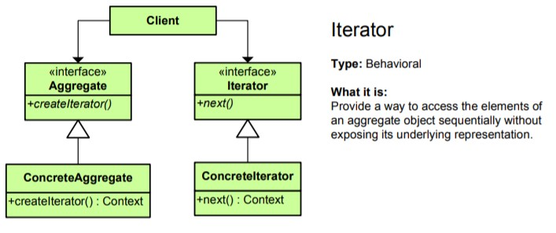
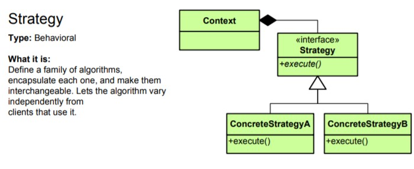
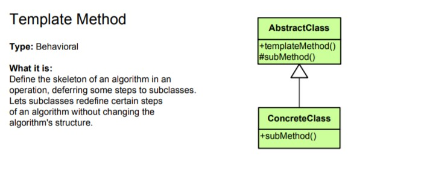

## ULTIMATE DESIGN PATTERNS
---
``` 
Design Reusable and Extensible Object-Oriented Software.
``` 

**Simplicity is the Ultimate Sophistication.**

***Don't Abuse the Design Pattern.***

## What are Design Patterns?

Elegant problems to repeating problems.

**23 Design Patterns** Documented in "**Design Patterns:** *Elements of Reusable Object-Oriented Software by GoF*".

Three Categories of these Design Patterns are:
1. Creational : *Different ways to create objectss*
2. Structural : *Relationship between objects*
3. Behavioural: *Interaction and communication between objects*

These design patterns helps us communcicate with other developers in abstract level.

## Essential OOP Concepts

- Classes 
- Interfaces
- Encapsulation
- Abstraction
- Inheritance 
- Polymorphism
- UML

### Coupling

It determines how much a class is coupled or dependent upon another class. In this a small changes in a class can create cascading change effect making it sometimes hard to make changes on the code.

It is so useful to make loosely-coupled codes. This can be achieved by making use of interfaces.

### Interfaces
It is a contract that specifies the capabilities that a class should provide. It only involves method declaration not the implementation. In doing so in our application we work with our interface classes than our concrete classes.

### Encapsulation
Access Modifiers are used to protect fields from outside classes. Setters and getters method can be provided to access these protected fields.

### Abstraction
It hides the unnecessary implementation details and save us from complexity of the class from the consumers. This can be achieved by making method private.

### Inheritance
Reusing the Classes.

### Polymorphism
Ability of objects to take on many forms. This can be achieved by making methods abstract. Thus, We should declare our class to be abstract.

### Unified Modeling Language
Diagrammatic representation of classes and relationships(Inheritance, Composition and Dependency) between them.

---

## Behavioural Design Pattern

<br>

### Memento Design Pattern



> It captures and restores an object's internal state.

Without violating the encapsulation, capture and externalize an object's internal state so that the object can be restored to this state later.

**Note:**

- **Caretaker** and **Memento** has composition relationship. 
i.e. **Caretaker** Object is composed of many **Memento** Objects.

- **Originator** and **Memento** class has dependency relationship. 

- By creating two different classes: **Memento** and **Originator** We save the **Single Repsonsibility Principle(SRP)**. 
**Originator** handles the objects and **Memento** class handles the state management.

Relevant codes for an undo function in Text Editors can be implemented using Memento Design Pattern and Relevant codes can be found under path: `designpatterns\behavioral\memento` package.

<br>

### State Design Pattern



> Alters an object's behavior when its state changes.

It can be achieved using Polymorphism and Interface/Abstract Class.

**Note**:
- It helps us implement **Open Closed Principle.** Open means our program is open for **extension** and closed for **modification**. Due to this we can add functionality to our code without modifying our main program.

Relevant codes for an Direction States in Direction Service can be implemented using State Design Pattern and Relevant codes can be found under path: `designpatterns\behavioural\state\statedesignimplementation` package.

<br>

### Iterator Pattern



> Sequentially access the element of a collection.

**Note**:
-  This helps us hide the internal implementation of iterator from the main class so that it doesn't break our main program when we choose to use differnet DS. we can simply make another iterator that implements Iterator interface. Relevant Iterator codes for an Product Collection can be implemented using Iterator Design Pattern and Relevant codes can be found under path: `designpatterns\behavioural\iterator` package.

<br>

### Strategy Pattern



> Encapsulates an Algorithm inside a Class.

**Note**
- It thus helps us to maintain **Single Responsibility** and **Open Close Principle.** Although it looks very similar to State Design, They are diferent. In state design, We could had a single state that showed various behaviours while here behaviour are initialized with different objects. Relevant Strategy Design Implementation can be found for Encryption algorith for Chat Client Application under path: `designpatterns\behavioural\strategy` package.

### Template Method



> It defers the exact steps of an algorithm to a subclass.

**Note:**
- It can make the use of the Abstract Class/Methods or Inheritance Relationship. It makes use of hooks operation leaving out subclass to either use it or override it. Relevant Template Design Method Implementation can be found for Window GUI Application under path: `designpatterns\behavioural\template` package.


